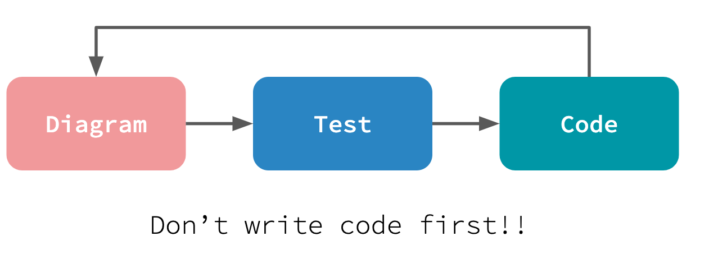
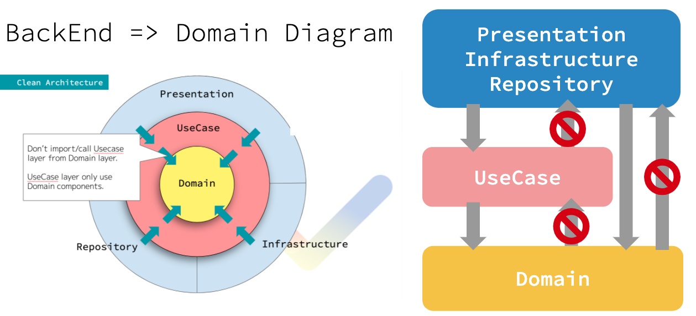
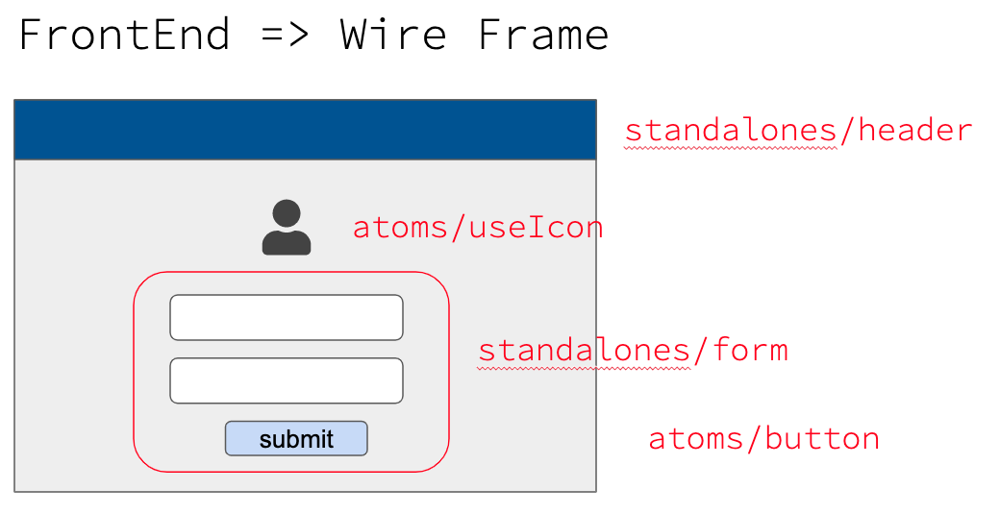

# LTTW
This is a exercise of good architecture.  
If you do each exercise step by step with the following way, you will learn a important clue for becoming a excellent developer!  

## What is "Good Code"
"Good Code" is ...
1. What works as expected
2. Readable
3. Changable

Items with smaller numbers have higher priority.

## Don't write code first

## Diagrams
For backend, please make a domain diagram with onion architecture.  
  

For frontend, please make a wire frame with atomic components.  

## For more information
Refer this [link](https://docs.google.com/presentation/d/1Q1fvKZGEP0BmNxYEPZFwmaQ2j-3jrRDfI2K1hjBkaLk/edit?usp=sharing)!  